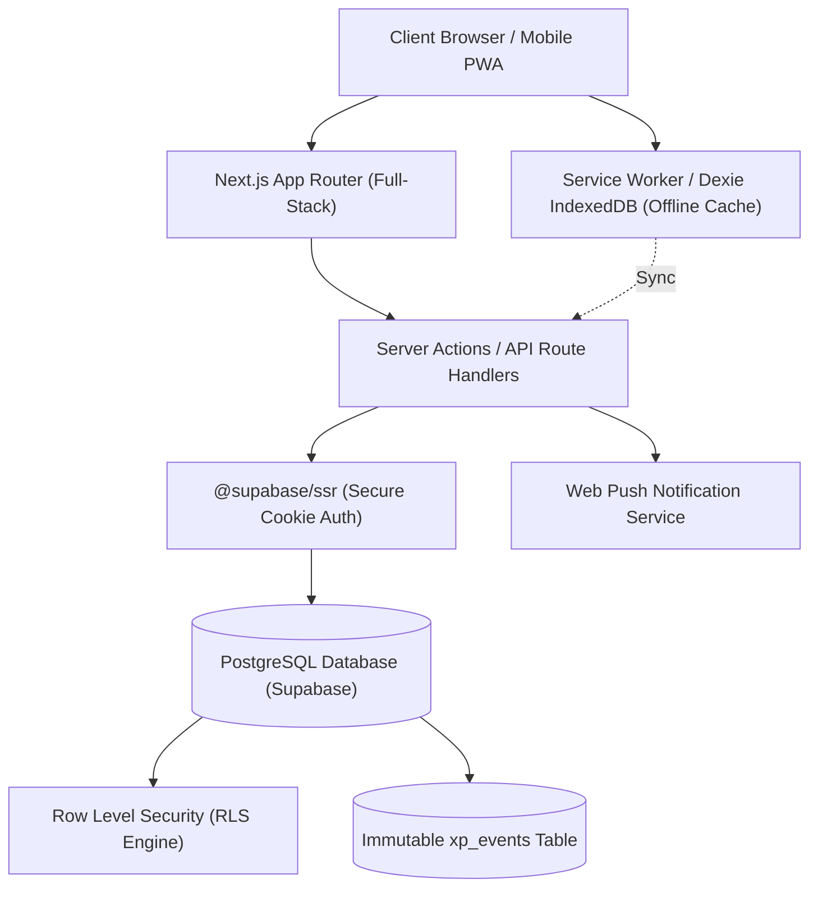
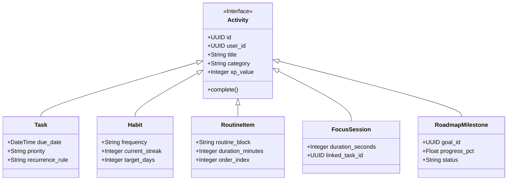
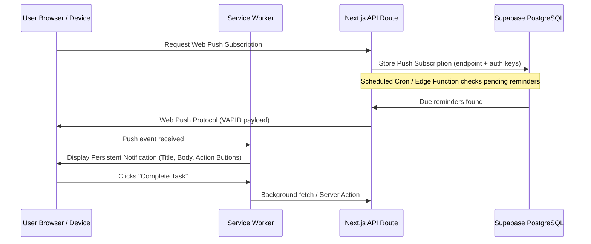

# LifeQuest — System Architecture

## 1. System Overview & Technology Stack

LifeQuest is engineered as a modern, full-stack, modular web application utilizing Next.js (App Router) backed by Supabase (PostgreSQL, Auth, Realtime, Storage, and Edge Functions).



### Stack Components
* **Framework**: Next.js 14+ / 15 (App Router with Server Components & Server Actions).
* **Language**: TypeScript (Strict mode enabled, no `any`, exhaustive type coverage).
* **Styling**: Tailwind CSS with custom design tokens, CSS variables, and glassmorphic utility layers.
* **Component Library**: shadcn/ui built on Radix UI / Base UI primitives for headless accessibility.
* **Animation & Micro-interactions**: Motion for React (`framer-motion`) with strict `prefers-reduced-motion` guards.
* **Backend Database & BaaS**: Supabase
  * PostgreSQL 15+ (Relational tables, foreign keys, triggers, constraints, generated columns).
  * Supabase Auth (Secure HttpOnly cookie-based session tokens via `@supabase/ssr`).
  * Row Level Security (RLS) guaranteeing multi-tenant user isolation at the database layer.
  * Supabase Realtime (Websocket synchronization for live updates across multi-device sessions).
* **State Management**:
  * **Server / Data State**: React Server Components (RSC) + Server Actions + Supabase queries with tag-based revalidation (`revalidateTag`, `revalidatePath`).
  * **Client UI State**: Zustand (restricted strictly to transient client-side state: active focus timer state, audio mute flags, collapsible navigation state, modal visibility).
  * **Form State**: React Hook Form coupled with Zod schema resolvers.
* **Time & Data Visualization**: `date-fns` for recurrence/calendar calculations; `Recharts` for analytics graphs.
* **PWA & Offline**: Web App Manifest, Service Worker (Workbox / Serwist), Dexie.js (IndexedDB wrapper for offline mutations and read caching).

---

## 2. Core Architectural Pattern: The "Life Activity" Engine

To prevent feature fragmentation (where tasks, habits, and focus modes exist as isolated silos), LifeQuest standardizes all quantifiable user commitments into the **Life Activity** architectural model.



### Event-Driven Completion Pipeline
Whenever any activity completes:
1. **Client Action**: Dispatches an optimistic UI state change with a fluid visual completion check.
2. **Server Action**: Validates user ownership and input via Zod schema.
3. **Database Transaction**:
   * Inserts activity completion entry (e.g. `task_completions`, `habit_completions`).
   * Appends an immutable record into `xp_events` with the exact `xp_amount`, `source_type`, and `source_id`.
   * Triggers a stored database procedure / trigger that recalculates total XP, current level, and streak counters within `user_stats`.
   * Evaluates active milestone criteria; updates milestone `progress_pct` if linked.
   * Evaluates achievement triggers (e.g., "7-Day Habit Streak", "Centurion: 100 Tasks Completed").
4. **Response**: Returns the updated player state, XP delta, level-up celebration flags, and any newly unlocked achievements.

---

## 3. Directory & File Organization

The application strictly follows Next.js App Router conventions with a domain-driven component organization:

```text
Life-Tracker/
├── app/
│   ├── (auth)/
│   │   ├── login/
│   │   ├── signup/
│   │   └── auth/callback/
│   ├── (dashboard)/
│   │   ├── layout.tsx              # Main authenticated app shell (Sidebar, TopBar, BottomNav)
│   │   ├── today/page.tsx          # Today Command Center
│   │   ├── overview/page.tsx       # Long-term analytics & statistics
│   │   ├── tasks/page.tsx          # Task list & management
│   │   ├── calendar/page.tsx       # Month, week, day calendar views
│   │   ├── habits/page.tsx         # Habits tracking & heatmaps
│   │   ├── routine/page.tsx        # Daily routine execution timeline
│   │   ├── roadmap/page.tsx        # Visual node-based milestone tree
│   │   ├── focus/page.tsx          # Focus mode Pomodoro timer
│   │   ├── expenses/page.tsx       # Personal budget & expense tracker
│   │   └── settings/page.tsx       # Profile, appearance, notifications
│   ├── api/
│   │   ├── webhooks/
│   │   └── push/
│   ├── layout.tsx                  # Global root layout with theme providers & fonts
│   ├── not-found.tsx               # Styled 404 page
│   ├── error.tsx                   # Global error boundary
│   └── globals.css                 # Base Tailwind styles & CSS variables
├── components/
│   ├── ui/                         # shadcn/ui atomic components (Button, Dialog, Dropdown, etc.)
│   ├── layout/                     # Sidebar, Topbar, MobileBottomNav, UserPill
│   ├── dashboard/                  # CircularProgress, StatCards, TodayFeed, QuickLinks
│   ├── tasks/                      # TaskCard, TaskModal, PriorityBadge, RecurrencePicker
│   ├── habits/                     # HabitCard, HabitHeatmap, StreakBadge
│   ├── calendar/                   # MonthGrid, WeekColumns, DayTimeline, EventCard
│   ├── routine/                    # RoutineBlock, RoutineItemRow, RoutineTimeline
│   ├── roadmap/                    # RoadmapCanvas, RoadmapNode, ConnectionLines, GoalModal
│   ├── focus/                      # FocusClock, EnvironmentCanvas, SessionLog
│   ├── expenses/                   # ExpenseList, BudgetGauge, CategoryDonut, ExpenseModal
│   └── gamification/               # XPNotification, LevelUpModal, StreakFlame, BadgeGrid
├── lib/
│   ├── supabase/                   # client.ts, server.ts, middleware.ts
│   ├── gamification/               # xp-calculator.ts, streak-calculator.ts, levels.ts
│   ├── notifications/              # web-push.ts, reminder-scheduler.ts
│   ├── calendar/                   # date-utils.ts, time-slots.ts
│   ├── recurrence/                 # rrule-parser.ts, occurrence-generator.ts
│   ├── analytics/                  # aggregation.ts, metrics.ts
│   └── validation/                 # task.schema.ts, habit.schema.ts, expense.schema.ts
├── hooks/                          # useCustomTimer, useMediaQuery, useRealtimeSync, etc.
├── stores/                         # useFocusStore, useUIStore (Zustand client stores)
├── types/                          # database.types.ts, activity.types.ts, gamification.types.ts
├── supabase/
│   ├── migrations/                 # Sequential SQL migration files
│   └── seed.sql                    # Initial development & testing seed data
├── public/
│   ├── icons/                      # PWA icons & module SVGs
│   ├── illustrations/              # Dark aesthetic vector assets
│   └── sw.js                       # Service worker for push & offline cache
├── docs/                           # Architectural, design, and specification documents
│   ├── PRODUCT_SPEC.md
│   ├── ARCHITECTURE.md
│   ├── DATABASE.md
│   ├── DESIGN_SYSTEM.md
│   └── STATUS.md
└── package.json
```

---

## 4. Recurrence & Calendar Engine Architecture

* **Problem**: Generating endless repeated rows in PostgreSQL causes table bloat, slow queries, and synchronization anomalies if the recurrence pattern changes.
* **Solution**:
  * Tasks store recurrence rules (e.g. `RRULE:FREQ=WEEKLY;BYDAY=MO,WE,FR`).
  * `task_occurrences` table records specific dates when an instance is generated or overridden.
  * Queries generate materialized occurrences on-the-fly for the current viewport (e.g. active month or week) using PostgreSQL's `generate_series()` or runtime date helpers.
  * When a user checks off a single instance, a row is inserted into `task_completions` tied to that specific `occurrence_date`.

---

## 5. Focus Timer Accuracy Architecture

* Standard browser `setInterval` or `setTimeout` mechanisms are throttled or frozen when the user switches tabs, minimizes the window, or locks the device.
* **Architecture**:
  * Focus sessions record a high-resolution starting epoch timestamp (`started_at = Date.now()`) and targeted duration.
  * The countdown display calculates `remaining = target_duration - (Date.now() - started_at - paused_time)`.
  * When tab visibility changes (`visibilitychange` API), the timer instantly recalculates the true elapsed duration.
  * Active sessions are saved in `localStorage` / Zustand; if the page is reloaded, the session seamlessly resumes with zero drift.

---

## 6. Notification & Service Worker Pipeline



* **Push API + Service Worker**: Persistent notifications work even when the tab is closed.
* **Permission Grace**: The UI gently educates the user on notification benefits before requesting browser notification permissions; gracefully falls back to in-app notification toasts if blocked.

---

## 7. Security & Integrity Architecture

1. **Authentication**: Handled via Supabase SSR auth with cryptographically secure, HttpOnly, SameSite cookies. No sensitive auth tokens are stored in unencrypted `localStorage`.
2. **Authorization (RLS)**: Every single table includes a strict Row Level Security policy:
   ```sql
   ALTER TABLE tasks ENABLE ROW LEVEL SECURITY;
   CREATE POLICY "Users can only manage their own tasks"
   ON tasks FOR ALL
   USING (auth.uid() = user_id)
   WITH CHECK (auth.uid() = user_id);
   ```
3. **Validation**: All incoming data from client forms, query params, and API payloads is strictly parsed with Zod schemas.
4. **Data Isolation**: Multi-tenant security ensures that even if an attacker manipulates API endpoints with another user's UUID, the database layer aborts the transaction with an access error.
