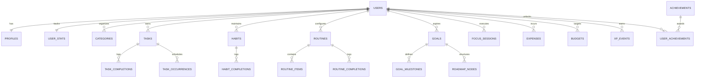

# LifeQuest — Database Schema & Architecture

## 1. Overview & Principles

LifeQuest utilizes **PostgreSQL** hosted on **Supabase**. The database architecture is built around data integrity, multi-tenant row-level isolation, event-sourced progression, and query performance.

### Key Database Conventions
1. **Primary Keys**: Every table uses UUID primary keys generated via `gen_random_uuid()`.
2. **Multi-Tenancy & Ownership**: All user-specific tables enforce an indexed `user_id UUID NOT NULL REFERENCES auth.users(id) ON DELETE CASCADE`.
3. **Row Level Security (RLS)**: RLS is enabled on 100% of tables. Users can only select, insert, update, or delete records where `auth.uid() = user_id`.
4. **Timestamps**: All temporal columns use `TIMESTAMPTZ` (UTC with timezone). Every mutable table has `created_at` and `updated_at` columns managed via an automatic database trigger.
5. **Event Sourcing for Gamification**: XP and leveling are calculated and auditable via an append-only `xp_events` table rather than arbitrary column increments.

---

## 2. Entity Relationship Overview



---

## 3. Table Definitions & Data Dictionary

### 3.1 User & System Profile
#### `profiles`
Stores extended user preferences, identity, and regional settings.
```sql
CREATE TABLE public.profiles (
    id UUID PRIMARY KEY REFERENCES auth.users(id) ON DELETE CASCADE,
    display_name TEXT NOT NULL,
    avatar_url TEXT,
    bio TEXT,
    timezone TEXT NOT NULL DEFAULT 'UTC',
    primary_currency TEXT NOT NULL DEFAULT 'BDT',
    theme TEXT NOT NULL DEFAULT 'graphite', -- 'graphite' | 'midnight' | 'slate'
    sound_enabled BOOLEAN NOT NULL DEFAULT true,
    particles_enabled BOOLEAN NOT NULL DEFAULT true,
    created_at TIMESTAMPTZ NOT NULL DEFAULT timezone('utc', now()),
    updated_at TIMESTAMPTZ NOT NULL DEFAULT timezone('utc', now())
);
```

#### `user_stats`
Denormalized player scorecard for high-frequency reads (updated via triggers on `xp_events`).
```sql
CREATE TABLE public.user_stats (
    user_id UUID PRIMARY KEY REFERENCES auth.users(id) ON DELETE CASCADE,
    total_xp BIGINT NOT NULL DEFAULT 0,
    current_level INTEGER NOT NULL DEFAULT 1,
    current_streak INTEGER NOT NULL DEFAULT 0,
    longest_streak INTEGER NOT NULL DEFAULT 0,
    last_active_date DATE,
    total_tasks_completed INTEGER NOT NULL DEFAULT 0,
    total_habits_completed INTEGER NOT NULL DEFAULT 0,
    total_focus_minutes INTEGER NOT NULL DEFAULT 0,
    updated_at TIMESTAMPTZ NOT NULL DEFAULT timezone('utc', now())
);
```

#### `categories`
Cross-module classifications (e.g. Work, Health, Personal, Learning, Finance).
```sql
CREATE TABLE public.categories (
    id UUID PRIMARY KEY DEFAULT gen_random_uuid(),
    user_id UUID NOT NULL REFERENCES auth.users(id) ON DELETE CASCADE,
    name TEXT NOT NULL,
    color TEXT NOT NULL DEFAULT '#6366F1',
    icon TEXT NOT NULL DEFAULT 'folder',
    created_at TIMESTAMPTZ NOT NULL DEFAULT timezone('utc', now())
);
```

---

### 3.2 Tasks & Calendar Module
#### `tasks`
```sql
CREATE TABLE public.tasks (
    id UUID PRIMARY KEY DEFAULT gen_random_uuid(),
    user_id UUID NOT NULL REFERENCES auth.users(id) ON DELETE CASCADE,
    category_id UUID REFERENCES public.categories(id) ON DELETE SET NULL,
    title TEXT NOT NULL,
    description TEXT,
    priority TEXT NOT NULL DEFAULT 'medium', -- 'low' | 'medium' | 'high' | 'urgent'
    difficulty TEXT NOT NULL DEFAULT 'normal', -- 'small' (+5XP) | 'normal' (+10XP) | 'difficult' (+20XP) | 'milestone' (+50XP)
    xp_value INTEGER NOT NULL DEFAULT 10,
    due_date DATE,
    due_time TIME,
    estimated_duration_minutes INTEGER,
    is_recurring BOOLEAN NOT NULL DEFAULT false,
    recurrence_rule TEXT, -- iCalendar RFC 5545 format (e.g., 'FREQ=WEEKLY;BYDAY=MO,WE,FR')
    parent_goal_id UUID, -- Optional foreign key to public.goals(id)
    is_completed BOOLEAN NOT NULL DEFAULT false,
    completed_at TIMESTAMPTZ,
    created_at TIMESTAMPTZ NOT NULL DEFAULT timezone('utc', now()),
    updated_at TIMESTAMPTZ NOT NULL DEFAULT timezone('utc', now())
);
```

#### `task_occurrences`
Generated runtime instances for recurring tasks to support single-instance edits and exclusions.
```sql
CREATE TABLE public.task_occurrences (
    id UUID PRIMARY KEY DEFAULT gen_random_uuid(),
    task_id UUID NOT NULL REFERENCES public.tasks(id) ON DELETE CASCADE,
    user_id UUID NOT NULL REFERENCES auth.users(id) ON DELETE CASCADE,
    occurrence_date DATE NOT NULL,
    is_cancelled BOOLEAN NOT NULL DEFAULT false,
    is_completed BOOLEAN NOT NULL DEFAULT false,
    completed_at TIMESTAMPTZ,
    UNIQUE(task_id, occurrence_date)
);
```

#### `task_completions`
Audit log of task completions (links directly to XP award).
```sql
CREATE TABLE public.task_completions (
    id UUID PRIMARY KEY DEFAULT gen_random_uuid(),
    task_id UUID NOT NULL REFERENCES public.tasks(id) ON DELETE CASCADE,
    user_id UUID NOT NULL REFERENCES auth.users(id) ON DELETE CASCADE,
    completed_date DATE NOT NULL,
    completed_at TIMESTAMPTZ NOT NULL DEFAULT timezone('utc', now()),
    xp_awarded INTEGER NOT NULL DEFAULT 10
);
```

#### `calendar_events`
Timed events distinct from task deadlines (meetings, scheduled focus blocks, travel).
```sql
CREATE TABLE public.calendar_events (
    id UUID PRIMARY KEY DEFAULT gen_random_uuid(),
    user_id UUID NOT NULL REFERENCES auth.users(id) ON DELETE CASCADE,
    category_id UUID REFERENCES public.categories(id) ON DELETE SET NULL,
    title TEXT NOT NULL,
    description TEXT,
    start_time TIMESTAMPTZ NOT NULL,
    end_time TIMESTAMPTZ NOT NULL,
    is_all_day BOOLEAN NOT NULL DEFAULT false,
    location TEXT,
    created_at TIMESTAMPTZ NOT NULL DEFAULT timezone('utc', now())
);
```

---

### 3.3 Habits Module
#### `habits`
```sql
CREATE TABLE public.habits (
    id UUID PRIMARY KEY DEFAULT gen_random_uuid(),
    user_id UUID NOT NULL REFERENCES auth.users(id) ON DELETE CASCADE,
    category_id UUID REFERENCES public.categories(id) ON DELETE SET NULL,
    title TEXT NOT NULL,
    description TEXT,
    frequency_type TEXT NOT NULL DEFAULT 'daily', -- 'daily' | 'weekly_days' | 'times_per_week'
    target_days_mask INTEGER DEFAULT 127, -- Bitmask for Mon-Sun (1111111 = 127)
    target_frequency INTEGER DEFAULT 1,
    time_of_day TEXT, -- 'morning' | 'afternoon' | 'evening' | 'anytime'
    xp_value INTEGER NOT NULL DEFAULT 5,
    is_archived BOOLEAN NOT NULL DEFAULT false,
    created_at TIMESTAMPTZ NOT NULL DEFAULT timezone('utc', now()),
    updated_at TIMESTAMPTZ NOT NULL DEFAULT timezone('utc', now())
);
```

#### `habit_completions`
```sql
CREATE TABLE public.habit_completions (
    id UUID PRIMARY KEY DEFAULT gen_random_uuid(),
    habit_id UUID NOT NULL REFERENCES public.habits(id) ON DELETE CASCADE,
    user_id UUID NOT NULL REFERENCES auth.users(id) ON DELETE CASCADE,
    completion_date DATE NOT NULL,
    status TEXT NOT NULL DEFAULT 'completed', -- 'completed' | 'skipped'
    skip_reason TEXT,
    created_at TIMESTAMPTZ NOT NULL DEFAULT timezone('utc', now()),
    UNIQUE(habit_id, completion_date)
);
```

---

### 3.4 Routine Module
#### `routines`
```sql
CREATE TABLE public.routines (
    id UUID PRIMARY KEY DEFAULT gen_random_uuid(),
    user_id UUID NOT NULL REFERENCES auth.users(id) ON DELETE CASCADE,
    name TEXT NOT NULL, -- e.g., 'Morning Priming', 'Evening Shutdown'
    block_type TEXT NOT NULL, -- 'morning' | 'work_study' | 'evening_night'
    start_time TIME,
    is_active BOOLEAN NOT NULL DEFAULT true,
    created_at TIMESTAMPTZ NOT NULL DEFAULT timezone('utc', now())
);
```

#### `routine_items`
```sql
CREATE TABLE public.routine_items (
    id UUID PRIMARY KEY DEFAULT gen_random_uuid(),
    routine_id UUID NOT NULL REFERENCES public.routines(id) ON DELETE CASCADE,
    user_id UUID NOT NULL REFERENCES auth.users(id) ON DELETE CASCADE,
    title TEXT NOT NULL,
    description TEXT,
    duration_minutes INTEGER NOT NULL DEFAULT 10,
    order_index INTEGER NOT NULL DEFAULT 0,
    is_optional BOOLEAN NOT NULL DEFAULT false,
    xp_value INTEGER NOT NULL DEFAULT 2,
    created_at TIMESTAMPTZ NOT NULL DEFAULT timezone('utc', now())
);
```

#### `routine_completions`
```sql
CREATE TABLE public.routine_completions (
    id UUID PRIMARY KEY DEFAULT gen_random_uuid(),
    routine_id UUID NOT NULL REFERENCES public.routines(id) ON DELETE CASCADE,
    user_id UUID NOT NULL REFERENCES auth.users(id) ON DELETE CASCADE,
    completion_date DATE NOT NULL,
    completed_items_count INTEGER NOT NULL,
    total_items_count INTEGER NOT NULL,
    is_fully_completed BOOLEAN NOT NULL DEFAULT true,
    bonus_xp_awarded INTEGER NOT NULL DEFAULT 10,
    completed_at TIMESTAMPTZ NOT NULL DEFAULT timezone('utc', now()),
    UNIQUE(routine_id, completion_date)
);
```

---

### 3.5 Roadmap & Goals Module
#### `goals`
```sql
CREATE TABLE public.goals (
    id UUID PRIMARY KEY DEFAULT gen_random_uuid(),
    user_id UUID NOT NULL REFERENCES auth.users(id) ON DELETE CASCADE,
    category_id UUID REFERENCES public.categories(id) ON DELETE SET NULL,
    title TEXT NOT NULL,
    vision_statement TEXT,
    target_date DATE,
    status TEXT NOT NULL DEFAULT 'active', -- 'draft' | 'active' | 'completed' | 'paused'
    progress_pct NUMERIC(5,2) NOT NULL DEFAULT 0.00,
    created_at TIMESTAMPTZ NOT NULL DEFAULT timezone('utc', now()),
    updated_at TIMESTAMPTZ NOT NULL DEFAULT timezone('utc', now())
);
```

#### `roadmap_nodes`
Visual node tree structure supporting interconnected milestone graphs.
```sql
CREATE TABLE public.roadmap_nodes (
    id UUID PRIMARY KEY DEFAULT gen_random_uuid(),
    goal_id UUID NOT NULL REFERENCES public.goals(id) ON DELETE CASCADE,
    user_id UUID NOT NULL REFERENCES auth.users(id) ON DELETE CASCADE,
    parent_node_id UUID REFERENCES public.roadmap_nodes(id) ON DELETE CASCADE,
    title TEXT NOT NULL,
    description TEXT,
    node_type TEXT NOT NULL DEFAULT 'milestone', -- 'objective' | 'milestone' | 'project' | 'skill'
    status TEXT NOT NULL DEFAULT 'locked', -- 'locked' | 'available' | 'active' | 'completed'
    position_x FLOAT NOT NULL DEFAULT 0.0,
    position_y FLOAT NOT NULL DEFAULT 0.0,
    target_date DATE,
    progress_pct NUMERIC(5,2) NOT NULL DEFAULT 0.00,
    xp_reward INTEGER NOT NULL DEFAULT 50,
    created_at TIMESTAMPTZ NOT NULL DEFAULT timezone('utc', now()),
    updated_at TIMESTAMPTZ NOT NULL DEFAULT timezone('utc', now())
);
```

---

### 3.6 Focus Sessions
#### `focus_sessions`
```sql
CREATE TABLE public.focus_sessions (
    id UUID PRIMARY KEY DEFAULT gen_random_uuid(),
    user_id UUID NOT NULL REFERENCES auth.users(id) ON DELETE CASCADE,
    task_id UUID REFERENCES public.tasks(id) ON DELETE SET NULL,
    roadmap_node_id UUID REFERENCES public.roadmap_nodes(id) ON DELETE SET NULL,
    target_duration_minutes INTEGER NOT NULL,
    actual_duration_seconds INTEGER NOT NULL,
    status TEXT NOT NULL DEFAULT 'completed', -- 'completed' | 'abandoned'
    environment_theme TEXT NOT NULL DEFAULT 'forest', -- 'forest' | 'space' | 'ocean' | 'cyber'
    notes TEXT,
    xp_awarded INTEGER NOT NULL DEFAULT 10,
    started_at TIMESTAMPTZ NOT NULL,
    ended_at TIMESTAMPTZ NOT NULL,
    created_at TIMESTAMPTZ NOT NULL DEFAULT timezone('utc', now())
);
```

---

### 3.7 Expenses & Financial Module
#### `expense_categories`
```sql
CREATE TABLE public.expense_categories (
    id UUID PRIMARY KEY DEFAULT gen_random_uuid(),
    user_id UUID NOT NULL REFERENCES auth.users(id) ON DELETE CASCADE,
    name TEXT NOT NULL,
    color TEXT NOT NULL DEFAULT '#10B981',
    icon TEXT NOT NULL DEFAULT 'credit-card',
    created_at TIMESTAMPTZ NOT NULL DEFAULT timezone('utc', now())
);
```

#### `expenses`
```sql
CREATE TABLE public.expenses (
    id UUID PRIMARY KEY DEFAULT gen_random_uuid(),
    user_id UUID NOT NULL REFERENCES auth.users(id) ON DELETE CASCADE,
    category_id UUID REFERENCES public.expense_categories(id) ON DELETE SET NULL,
    amount NUMERIC(12,2) NOT NULL CHECK (amount > 0),
    currency TEXT NOT NULL DEFAULT 'BDT',
    date DATE NOT NULL,
    payment_method TEXT, -- 'cash' | 'card' | 'bkash' | 'nagad' | 'bank_transfer'
    note TEXT,
    is_recurring BOOLEAN NOT NULL DEFAULT false,
    created_at TIMESTAMPTZ NOT NULL DEFAULT timezone('utc', now())
);
```

#### `budgets`
```sql
CREATE TABLE public.budgets (
    id UUID PRIMARY KEY DEFAULT gen_random_uuid(),
    user_id UUID NOT NULL REFERENCES auth.users(id) ON DELETE CASCADE,
    category_id UUID REFERENCES public.expense_categories(id) ON DELETE CASCADE,
    month INTEGER NOT NULL CHECK (month BETWEEN 1 AND 12),
    year INTEGER NOT NULL CHECK (year >= 2024),
    allocated_amount NUMERIC(12,2) NOT NULL CHECK (allocated_amount >= 0),
    currency TEXT NOT NULL DEFAULT 'BDT',
    created_at TIMESTAMPTZ NOT NULL DEFAULT timezone('utc', now()),
    UNIQUE(user_id, category_id, month, year)
);
```

---

### 3.8 Gamification, Reminders & Notifications
#### `xp_events` (Append-Only Event Store)
```sql
CREATE TABLE public.xp_events (
    id UUID PRIMARY KEY DEFAULT gen_random_uuid(),
    user_id UUID NOT NULL REFERENCES auth.users(id) ON DELETE CASCADE,
    source_type TEXT NOT NULL, -- 'task' | 'habit' | 'routine' | 'focus' | 'roadmap' | 'achievement' | 'bonus'
    source_id UUID,
    xp_amount INTEGER NOT NULL CHECK (xp_amount > 0),
    description TEXT,
    created_at TIMESTAMPTZ NOT NULL DEFAULT timezone('utc', now())
);
```

#### `achievements`
System-defined milestone rewards.
```sql
CREATE TABLE public.achievements (
    id TEXT PRIMARY KEY, -- e.g., 'streak_7_days', 'tasks_100', 'focus_50_hours'
    title TEXT NOT NULL,
    description TEXT NOT NULL,
    badge_icon TEXT NOT NULL,
    tier TEXT NOT NULL DEFAULT 'bronze', -- 'bronze' | 'silver' | 'gold' | 'platinum'
    xp_bonus INTEGER NOT NULL DEFAULT 50
);
```

#### `user_achievements`
```sql
CREATE TABLE public.user_achievements (
    id UUID PRIMARY KEY DEFAULT gen_random_uuid(),
    user_id UUID NOT NULL REFERENCES auth.users(id) ON DELETE CASCADE,
    achievement_id TEXT NOT NULL REFERENCES public.achievements(id) ON DELETE CASCADE,
    unlocked_at TIMESTAMPTZ NOT NULL DEFAULT timezone('utc', now()),
    UNIQUE(user_id, achievement_id)
);
```

#### `reminders` & `notification_preferences`
```sql
CREATE TABLE public.reminders (
    id UUID PRIMARY KEY DEFAULT gen_random_uuid(),
    user_id UUID NOT NULL REFERENCES auth.users(id) ON DELETE CASCADE,
    source_type TEXT NOT NULL, -- 'task' | 'habit' | 'routine' | 'calendar'
    source_id UUID NOT NULL,
    remind_at TIMESTAMPTZ NOT NULL,
    is_sent BOOLEAN NOT NULL DEFAULT false,
    created_at TIMESTAMPTZ NOT NULL DEFAULT timezone('utc', now())
);

CREATE TABLE public.notification_preferences (
    user_id UUID PRIMARY KEY REFERENCES auth.users(id) ON DELETE CASCADE,
    push_subscription JSONB, -- Web Push subscription object
    browser_push_enabled BOOLEAN NOT NULL DEFAULT false,
    daily_digest_time TIME DEFAULT '08:00',
    quiet_hours_start TIME DEFAULT '22:00',
    quiet_hours_end TIME DEFAULT '07:00',
    updated_at TIMESTAMPTZ NOT NULL DEFAULT timezone('utc', now())
);
```

---

## 4. Database Indexes Strategy

To guarantee sub-50ms query responses, indexes are placed on multi-tenant foreign keys, filter predicates, and date ranges:

```sql
-- Multi-tenant isolation lookups
CREATE INDEX idx_tasks_user_due ON public.tasks(user_id, due_date) WHERE is_completed = false;
CREATE INDEX idx_habits_user_active ON public.habits(user_id) WHERE is_archived = false;
CREATE INDEX idx_habit_completions_lookup ON public.habit_completions(user_id, completion_date);
CREATE INDEX idx_routine_items_order ON public.routine_items(routine_id, order_index);
CREATE INDEX idx_focus_sessions_user_date ON public.focus_sessions(user_id, started_at);
CREATE INDEX idx_expenses_user_date ON public.expenses(user_id, date);
CREATE INDEX idx_xp_events_user_time ON public.xp_events(user_id, created_at);
CREATE INDEX idx_reminders_pending ON public.reminders(remind_at) WHERE is_sent = false;
```

---

## 5. Automated Database Triggers

### 5.1 Profile & Stats Provisioning on User Signup
```sql
CREATE OR REPLACE FUNCTION public.handle_new_user()
RETURNS TRIGGER AS $$
BEGIN
    INSERT INTO public.profiles (id, display_name)
    VALUES (new.id, COALESCE(new.raw_user_meta_data->>'full_name', split_part(new.email, '@', 1)));

    INSERT INTO public.user_stats (user_id)
    VALUES (new.id);

    INSERT INTO public.notification_preferences (user_id)
    VALUES (new.id);

    RETURN NEW;
END;
$$ LANGUAGE plpgsql SECURITY DEFINER;

CREATE TRIGGER on_auth_user_created
    AFTER INSERT ON auth.users
    FOR EACH ROW EXECUTE FUNCTION public.handle_new_user();
```

### 5.2 Dynamic Stats Updating via `xp_events` Trigger
```sql
CREATE OR REPLACE FUNCTION public.update_user_stats_from_xp()
RETURNS TRIGGER AS $$
DECLARE
    new_total BIGINT;
    calc_level INTEGER;
BEGIN
    SELECT COALESCE(SUM(xp_amount), 0) INTO new_total
    FROM public.xp_events
    WHERE user_id = NEW.user_id;

    -- Level equation: 50*(L-1)^2 + 50*(L-1) <= XP
    -- Solving for L: L = floor((sqrt(200*XP + 25) + 25) / 100) + 1
    calc_level := GREATEST(1, FLOOR((SQRT(200 * new_total + 25) + 25) / 100)::INTEGER);

    UPDATE public.user_stats
    SET total_xp = new_total,
        current_level = calc_level,
        updated_at = timezone('utc', now())
    WHERE user_id = NEW.user_id;

    RETURN NEW;
END;
$$ LANGUAGE plpgsql SECURITY DEFINER;

CREATE TRIGGER on_xp_event_added
    AFTER INSERT ON public.xp_events
    FOR EACH ROW EXECUTE FUNCTION public.update_user_stats_from_xp();
```
